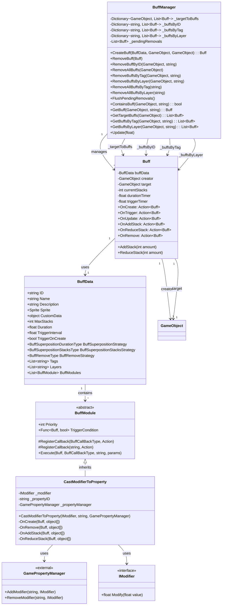
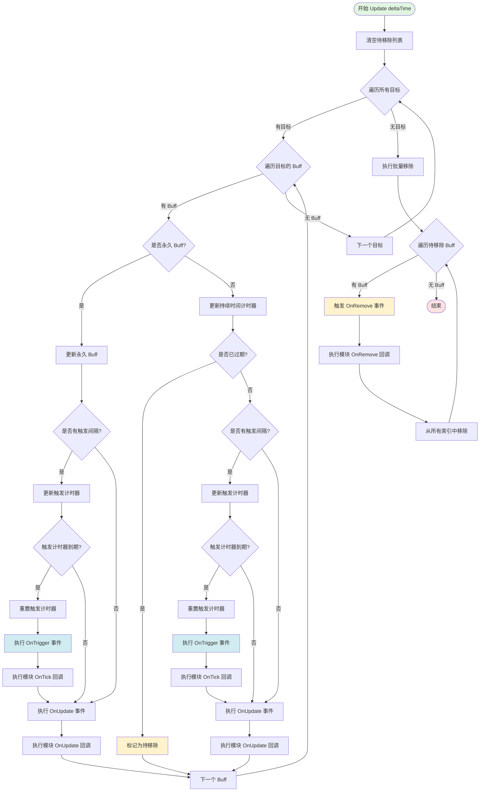
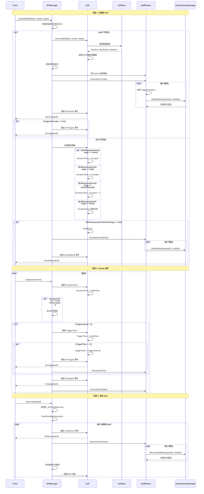
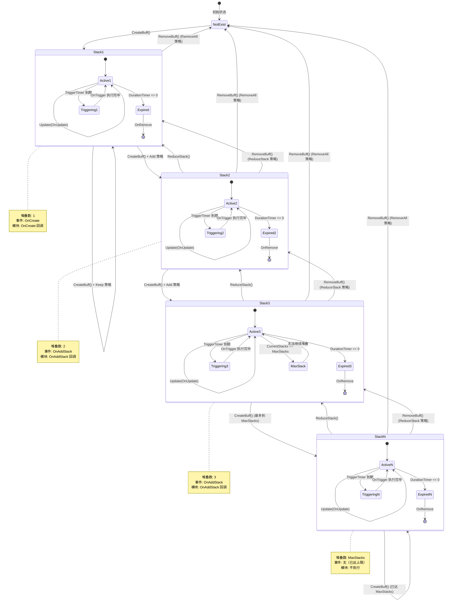
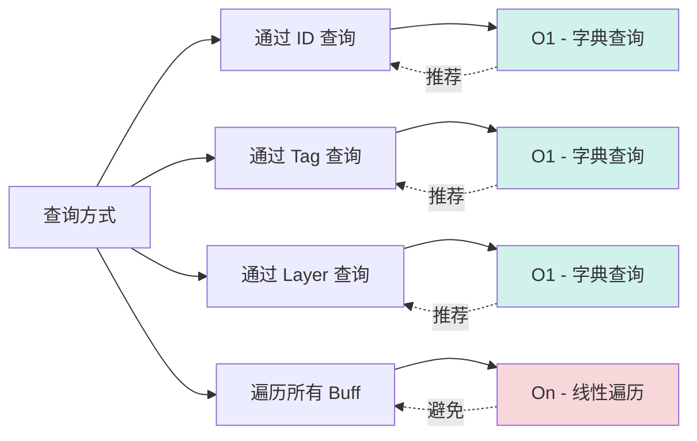
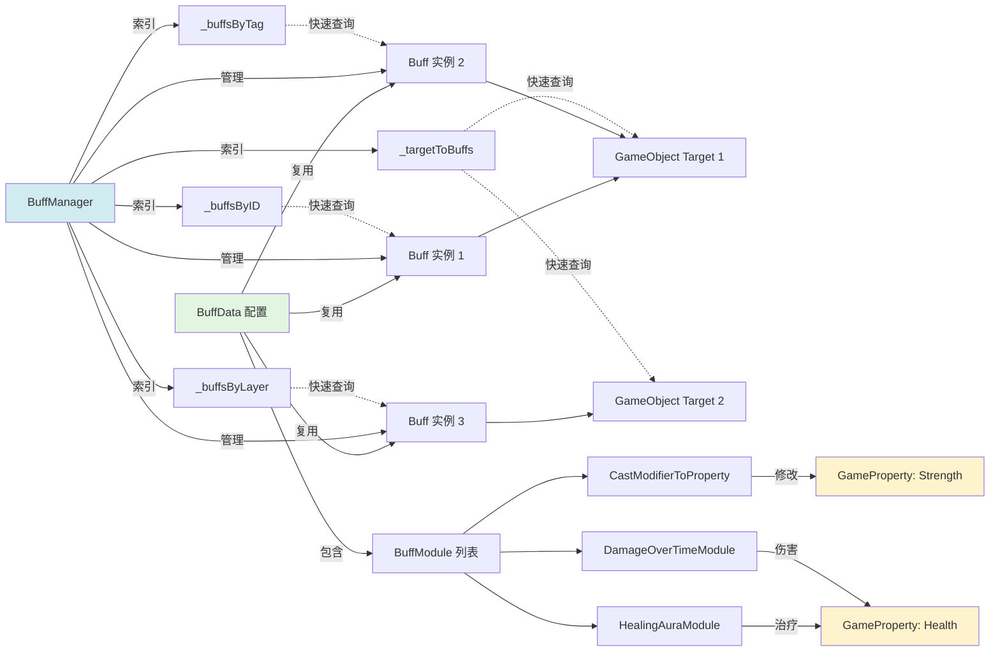

# Buff System - Diagrams

**适用EasyPack版本：** EasyPack v1.5.30
**最后更新：** 2025-10-26

---

本文档提供 Buff System 的可视化架构图和流程图，帮助理解系统设计和数据流。

---

## 目录

- [概述](#概述)
- [图表索引](#图表索引)
- [1. 类结构图](#1-类结构图)
- [2. BuffManager 更新流程图](#2-buffmanager-更新流程图)
- [3. Buff 生命周期序列图](#3-buff-生命周期序列图)
- [4. Buff 堆叠状态图](#4-buff-堆叠状态图)
- [补充图表](#补充图表)
- [数据流图](#数据流图)
- [图表使用指南](#图表使用指南)
- [相关资源](#相关资源)

---

## 图表索引

1. [类结构图](#1-类结构图) - 核心类及其关系
2. [BuffManager 更新流程图](#2-buffmanager-更新流程图) - Update 方法的执行流程
3. [Buff 生命周期序列图](#3-buff-生命周期序列图) - 创建到移除的完整流程
4. [Buff 堆叠状态图](#4-buff-堆叠状态图) - 堆叠策略状态转换

---

## 1. 类结构图

展示 Buff System 的核心类及其关系。

**关键点：**
- `Buff` 持有 `BuffData` 配置和生命周期状态
- `BuffManager` 使用多个字典索引 Buff，支持快速查询
- `BuffModule` 是抽象基类，可扩展实现各种效果
- `CastModifierToProperty` 桥接 Buff 系统和属性系统

---

## 2. BuffManager 更新流程图

展示 `BuffManager.Update()` 方法的执行流程。

**关键点：**
1. **双阶段处理**：先标记待移除，最后批量移除
2. **永久 Buff**：跳过持续时间检查，仅处理触发逻辑
3. **触发优先级**：先处理 `OnTrigger`，再处理 `OnUpdate`
4. **模块执行**：按优先级顺序执行所有模块的回调
5. **Swap-Remove 优化**：移除时使用交换删除算法（O(1) 复杂度）

---

## 3. Buff 生命周期序列图

展示从创建到移除的完整生命周期。

**关键流程：**
1. **创建阶段**：初始化 → 添加索引 → 执行模块 `OnCreate` → 触发事件
2. **叠加处理**：检查已存在 → 应用叠加策略 → 更新堆叠/时间 → 执行模块回调
3. **更新循环**：更新计时器 → 检查过期 → 触发周期事件 → 执行模块回调
4. **移除阶段**：触发 `OnRemove` → 执行模块清理 → 移除索引 → 销毁对象

---

## 4. Buff 堆叠状态图

展示不同堆叠策略下的状态转换。

**状态说明：**

| 状态 | 触发条件 | 执行操作 |
|------|---------|---------|
| **NotExist** | 初始状态 | 无 Buff 实例 |
| **Stack1** | `CreateBuff()` 首次调用 | 触发 `OnCreate`，执行模块 `OnCreate` |
| **Stack2** | `CreateBuff()` + `Add` 策略 | 触发 `OnAddStack`，执行模块 `OnAddStack` |
| **Stack3...N** | 继续 `CreateBuff()` | 继续堆叠直到 `MaxStacks` |
| **MaxStack** | `CurrentStacks == MaxStacks` | 无法继续堆叠，忽略后续 `CreateBuff()` |
| **Active** | 正常运行 | 每帧执行 `OnUpdate` |
| **Triggering** | `TriggerTimer <= 0` | 执行 `OnTrigger` 和模块 `OnTick` |
| **Expired** | `DurationTimer <= 0` | 触发 `OnRemove`，移除 Buff |

**移除策略：**

- **RemoveAll**：直接从任意堆叠状态转换到 `NotExist`
- **ReduceStack**：每次调用减少一层堆叠，直到堆叠为 0 时转换到 `NotExist`

---

## 补充图表

### 5. 索引查询性能对比

不同查询方式的时间复杂度对比：

**性能建议：**
- ✅ 使用索引查询（ID、Tag、Layer）：O(1) 时间复杂度
- ❌ 避免遍历查询：O(n) 时间复杂度，大量 Buff 时性能差

---

### 6. 模块执行优先级示例

展示多个模块的执行顺序：

```mermaid
gantt
    title Buff 模块执行顺序（按 Priority 降序）
    dateFormat X
    axisFormat %s

    section Priority 100
    属性修改模块 (Add Modifier)    :done, 0, 1
    
    section Priority 90
    属性修改模块 (Mul Modifier)    :done, 1, 2
    
    section Priority 50
    治疗光环模块 (Healing)         :done, 2, 3
    
    section Priority 30
    伤害模块 (DoT)                 :done, 3, 4
    
    section Priority 10
    视觉效果模块 (VFX)             :done, 4, 5
    
    section Priority 0
    调试日志模块 (Debug)           :done, 5, 6
```

**优先级设置建议：**
- **100+**：属性修改（Add）
- **90+**：属性修改（Mul）
- **50-89**：游戏逻辑（治疗、伤害、状态检查）
- **10-49**：视觉效果、音效
- **0-9**：调试、日志

---

## 数据流图

### 7. Buff 数据流向

**数据流说明：**
1. **配置复用**：一个 `BuffData` 可被多个 `Buff` 实例复用
2. **模块共享**：`BuffData.BuffModules` 被所有实例共享
3. **多重索引**：`BuffManager` 维护多个字典加速查询
4. **属性修改**：`BuffModule` 通过 `GamePropertyManager` 修改属性

---

## 图表使用指南

### 如何阅读这些图表

1. **类结构图**：理解系统的静态架构和类之间的关系
2. **流程图**：理解 `Update` 方法的执行流程和性能优化点
3. **序列图**：理解 Buff 的完整生命周期和事件触发顺序
4. **状态图**：理解堆叠策略的状态转换和边界条件

---

## 相关资源

- [用户指南](./UserGuide.md) - 任务导向的使用指南
- [API 参考](./APIReference.md) - 详细的方法签名和参数说明
- [示例代码](../Example/BuffExample.cs) - 完整的使用示例

---

**维护者：** EasyPack 团队  
**许可证：** 遵循项目主许可证
