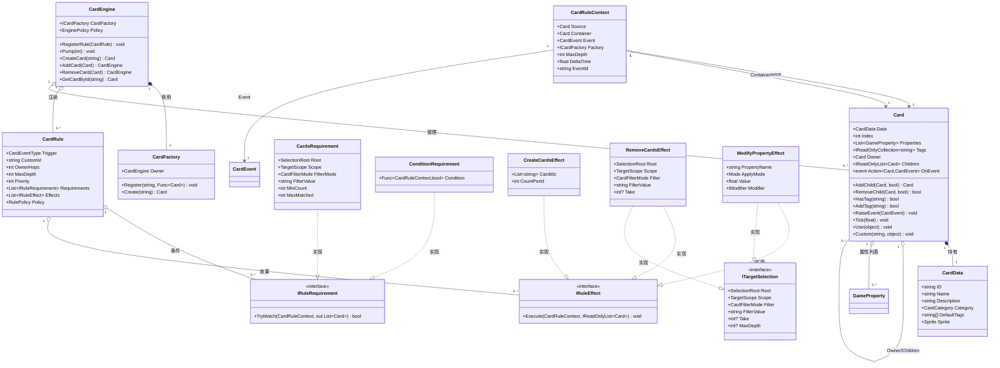
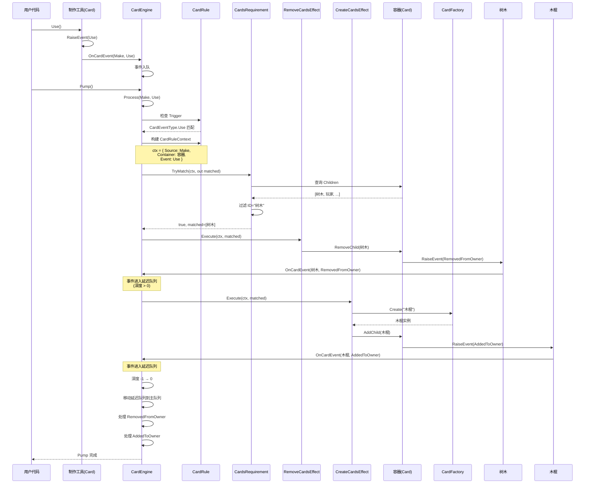
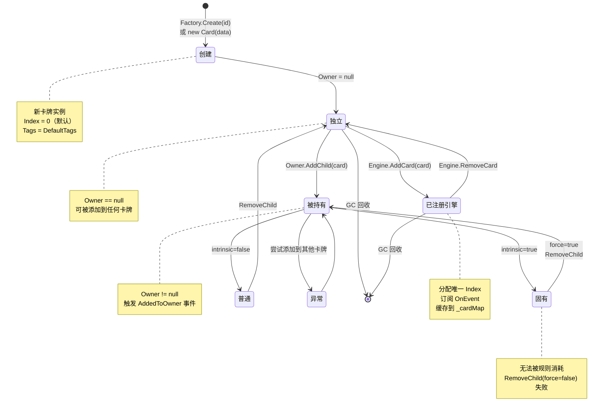

# EmeCard 系统 - Mermaid 图集文档

**适用EasyPack版本：** EasyPack v1.5.30  
**最后更新：** 2025-10-26

---

## 目录

1. [核心类图](#核心类图)
2. [事件驱动流程图](#事件驱动流程图)
3. [规则执行序列图](#规则执行序列图)
4. [卡牌层次结构状态图](#卡牌层次结构状态图)

---

## 核心类图

### 说明

本图展示 EmeCard 系统的核心类及其关系：

- **Card**：卡牌实例，系统基本单元
- **CardEngine**：核心引擎，管理卡牌生命周期和规则执行
- **CardRule**：数据驱动的规则定义
- **CardRuleContext**：规则执行上下文
- **CardFactory**：卡牌工厂，根据 ID 创建实例
- **IRuleRequirement** / **IRuleEffect**：规则组件接口

**关键设计决策**：
1. **组合优于继承**：Card 通过组合持有 `CardData`、`GameProperty`、子卡列表
2. **事件驱动**：Card 通过 `OnEvent` 委托与 Engine 解耦
3. **策略模式**：通过 `IRuleRequirement` 和 `IRuleEffect` 实现可扩展的规则系统
4. **工厂模式**：CardFactory 解耦卡牌创建逻辑

---

## 事件驱动流程图

### 说明

本图展示从卡牌触发事件到规则执行的完整流程：

1. **事件触发**：Card 调用 `Tick()` / `Use()` / `Custom()` 触发事件
2. **事件入队**：CardEngine 的 `OnCardEvent` 回调将事件加入队列
3. **事件处理**：`Pump()` 循环处理队列中的事件
4. **规则匹配**：遍历注册的规则，检查事件类型、CustomId、条件
5. **效果执行**：执行匹配成功的规则效果
6. **延迟队列**：规则执行过程中触发的新事件进入延迟队列，避免迭代器失效

**关键机制**：
- **延迟队列**：防止事件处理过程中修改主队列导致的问题
- **最大事件数**：防止死循环（默认 2048）
- **优先级排序**：支持按注册顺序或优先级排序

```mermaid
flowchart TD
    Start([卡牌触发事件]) --> TriggerEvent[Card.Tick / Use / Custom]
    TriggerEvent --> RaiseEvent[Card.RaiseEvent]
    RaiseEvent --> OnEvent{OnEvent<br/>订阅者}
    OnEvent --> EngineCallback[CardEngine.OnCardEvent]
    
    EngineCallback --> CheckDepth{处理深度 > 0?}
    CheckDepth -->|是| DeferQueue[加入延迟队列]
    CheckDepth -->|否| MainQueue[加入主队列]
    
    MainQueue --> CheckPump{是否正在<br/>Pumping?}
    CheckPump -->|否| Pump[触发 Pump]
    CheckPump -->|是| Wait[等待当前 Pump 完成]
    DeferQueue --> Wait
    
    Pump --> PumpLoop{主队列<br/>是否为空?}
    PumpLoop -->|否| Dequeue[取出事件]
    PumpLoop -->|是| CheckDeferred{延迟队列<br/>是否为空?}
    
    Dequeue --> Process[Process 事件]
    Process --> IncrDepth[深度 +1]
    IncrDepth --> MatchRules[遍历规则表]
    
    MatchRules --> CheckTrigger{事件类型<br/>匹配?}
    CheckTrigger -->|否| NextRule[下一条规则]
    CheckTrigger -->|是| CheckCustomId{CustomId<br/>匹配?}
    
    CheckCustomId -->|否| NextRule
    CheckCustomId -->|是| BuildContext[构建 CardRuleContext]
    BuildContext --> EvalReq[评估所有要求项]
    
    EvalReq --> AllMatch{所有要求项<br/>通过?}
    AllMatch -->|否| NextRule
    AllMatch -->|是| AddToEvals[加入候选列表]
    
    AddToEvals --> NextRule
    NextRule --> MoreRules{还有规则?}
    MoreRules -->|是| MatchRules
    MoreRules -->|否| SortEvals{引擎策略}
    
    SortEvals -->|Priority| SortByPriority[按 Priority 排序]
    SortEvals -->|RegistrationOrder| SortByOrder[按注册顺序]
    
    SortByPriority --> CheckFirstOnly{FirstMatchOnly?}
    SortByOrder --> CheckFirstOnly
    
    CheckFirstOnly -->|是| ExecFirst[执行第一条规则]
    CheckFirstOnly -->|否| ExecLoop[依次执行所有规则]
    
    ExecFirst --> ExecEffects[执行效果管线]
    ExecLoop --> ExecEffects
    
    ExecEffects --> CheckStop{StopEventOnSuccess?}
    CheckStop -->|是| DecrDepth[深度 -1]
    CheckStop -->|否| NextExec{还有规则?}
    
    NextExec -->|是| ExecEffects
    NextExec -->|否| DecrDepth
    
    DecrDepth --> CheckDepthZero{深度 == 0?}
    CheckDepthZero -->|是| MoveDeferToMain[延迟队列<br/>移入主队列]
    CheckDepthZero -->|否| PumpLoop
    
    MoveDeferToMain --> PumpLoop
    
    CheckDeferred -->|否| MoveDeferToMain
    CheckDeferred -->|是| End([Pump 完成])
```

---

## 规则执行序列图

### 说明

本图展示一个典型的规则执行场景：玩家使用"制作"工具时，如果有"树木"，消耗树木生成木棍。

**关键交互**：
1. 用户调用 `make.Use()`
2. 引擎匹配规则并构建上下文
3. 要求项检查容器中是否有"树木"
4. 效果 1 移除树木
5. 效果 2 创建木棍
6. 新卡牌触发 `AddedToOwner` 事件（进入延迟队列）

**设计模式体现**：
- **责任链模式**：要求项依次检查，任一失败则整体失败
- **命令模式**：效果封装为独立对象，顺序执行
- **观察者模式**：卡牌事件通过 `OnEvent` 通知订阅者

---

## 卡牌层次结构状态图

### 说明

本图展示卡牌在生命周期中的状态转换：

1. **创建**：通过 Factory 或构造函数创建
2. **独立**：未被任何卡牌持有
3. **被持有**：被添加为某卡的子卡
4. **固有**：被标记为固有子卡（特殊状态）
5. **移除**：从持有者移除
6. **销毁**：引擎注销或 GC 回收

**关键状态**：
- **独立状态**：`Owner == null`，可被自由添加到任何卡牌
- **被持有状态**：`Owner != null`，尝试添加到其他卡牌会抛出异常
- **固有状态**：普通 `RemoveChild` 无法移除，必须 `force=true`

**事件触发**：
- `AddedToOwner`：独立 → 被持有
- `RemovedFromOwner`：被持有 → 独立

---

## 补充说明

### 性能关键路径

1. **事件入队**：O(1)，使用 `Queue<EventEntry>`
2. **规则匹配**：O(N * M)，N=规则数，M=要求项数
3. **目标选择**：O(D * C)，D=深度，C=子卡数
   - `TargetScope.Children`：O(C)
   - `TargetScope.Descendants`：O(D * C)
4. **效果执行**：O(E * T)，E=效果数，T=目标数

**优化建议**：
- 限制 `MaxDepth` 减少递归开销
- 使用 `Take` 限制匹配数量
- 合理使用 `StopPropagation` 减少规则遍历
- 避免在规则中触发循环事件

---

**维护者**：NEKOPACK 团队  
**联系方式**：提交 GitHub Issue 或 Pull Request  
**许可证**：遵循项目主许可证
